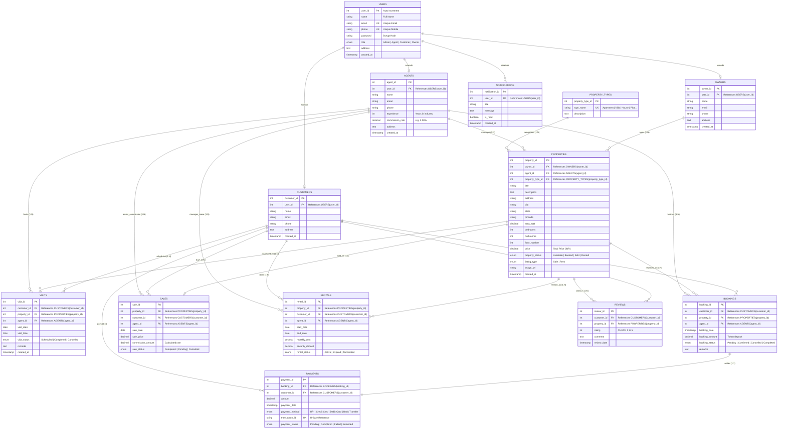

# REAL ESTATE MANAGEMENT SYSTEM (REMS)
## Entity-Relationship (ER) Diagram & Relational Schema Documentation
**5th Semester B.Tech AI & Data Science — DBMS Project**

---

## 1. Visual Mermaid ER Diagram

---

## 2. Cardinality & Relationship Breakdown

| Entity 1 | Cardinality | Entity 2 | Explanation |
| :--- | :---: | :--- | :--- |
| **Users** | `1 : 0..1` | **Customers** | A user with role 'Customer' has exactly one customer profile. |
| **Users** | `1 : 0..1` | **Agents** | A user with role 'Agent' has exactly one professional agent record. |
| **Users** | `1 : 0..1` | **Owners** | A user with role 'Owner' has exactly one owner record. |
| **Owners** | `1 : N` | **Properties** | One property owner can register and list multiple properties. |
| **Agents** | `1 : N` | **Properties** | One certified agent manages multiple assigned property listings. |
| **Property_Types** | `1 : N` | **Properties** | A property type (Apartment, Villa, etc.) categorizes many properties. |
| **Customers** | `1 : N` | **Visits** | A customer can schedule multiple site inspection appointments. |
| **Properties** | `1 : N` | **Visits** | A property can be visited by multiple prospective buyers across dates. |
| **Agents** | `1 : N` | **Visits** | An agent conducts physical site visits for interested clients. |
| **Customers** | `1 : N` | **Bookings** | A customer can make multiple bookings over time. |
| **Properties** | `1 : N` | **Bookings** | A property can have historical bookings (Cancelled, Completed) but only one active 'Confirmed' booking. |
| **Agents** | `1 : N` | **Bookings** | An agent facilitates bookings for their assigned properties. |
| **Bookings** | `1 : 1..N` | **Payments** | A booking has corresponding payment ledger transactions (advance token, full balance, or refund). |
| **Properties** | `1 : 1` | **Sales** | A finalized property sale deed is tied to a specific property. |
| **Customers** | `1 : N` | **Sales** | A customer can purchase one or more properties. |
| **Agents** | `1 : N` | **Sales** | An agent earns commission on each finalized property sale. |
| **Properties** | `1 : N` | **Rentals** | A property can have consecutive rental lease agreements over its lifecycle. |
| **Customers** | `1 : N` | **Rentals** | A customer can rent properties under active lease agreements. |
| **Customers** | `1 : N` | **Reviews** | A customer can review properties they have visited or booked. |
| **Properties** | `1 : N` | **Reviews** | A property collects ratings and reviews from verified clients. |

---

## 3. Relational Schema Representation

Underline indicates **Primary Key (PK)**; italics / bold indicates **Foreign Key (FK)**:

1. `users` (<u>user_id</u>, name, email, phone, password, role, address, created_at)
2. `owners` (<u>owner_id</u>, **user_id**, name, email, phone, address, created_at)
3. `agents` (<u>agent_id</u>, **user_id**, name, email, phone, experience, commission_rate, address, created_at)
4. `customers` (<u>customer_id</u>, **user_id**, name, email, phone, address, created_at)
5. `property_types` (<u>property_type_id</u>, type_name, description)
6. `properties` (<u>property_id</u>, **owner_id**, **agent_id**, **property_type_id**, title, description, address, city, state, pincode, area_sqft, bedrooms, bathrooms, floor_number, price, property_status, listing_type, image_url, created_at)
7. `visits` (<u>visit_id</u>, **customer_id**, **property_id**, **agent_id**, visit_date, visit_time, visit_status, remarks, created_at)
8. `bookings` (<u>booking_id</u>, **customer_id**, **property_id**, **agent_id**, booking_date, booking_amount, booking_status, remarks)
9. `payments` (<u>payment_id</u>, **booking_id**, **customer_id**, amount, payment_date, payment_method, transaction_id, payment_status)
10. `sales` (<u>sale_id</u>, **property_id**, **customer_id**, **agent_id**, sale_date, sale_price, commission_amount, sale_status)
11. `rentals` (<u>rental_id</u>, **property_id**, **customer_id**, **agent_id**, start_date, end_date, monthly_rent, security_deposit, rental_status)
12. `reviews` (<u>review_id</u>, **customer_id**, **property_id**, rating, comment, review_date)
13. `notifications` (<u>notification_id</u>, **user_id**, title, message, is_read, created_at)
